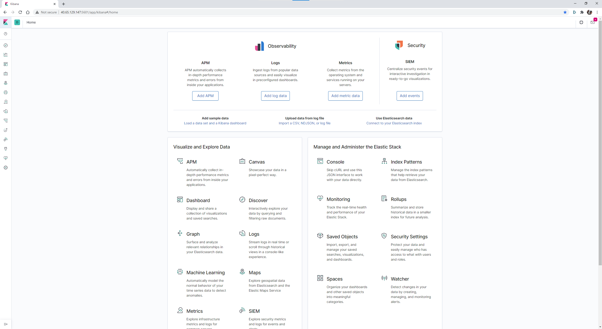

# Automated ELK Stack Deployment

The files in this repository were used to configure the network depicted below.

These files have been tested and used to generate a live ELK deployment on Azure. They can be used to either recreate the entire deployment pictured above. Alternatively, select portions of the playbook file may be used to install only certain pieces of it, such as Filebeat.

- [ELK Install Playbook](files/install-elk.yml)
- [Filebeat Playbook](files/filebeat-playbook.yml)
- [Metricbeat Playbook](files/metricbeat-playbook.yml)

This document contains the following details:

- Description of the Topology
- Access Policies
- ELK Configuration
  - Beats in Use
  - Machines Being Monitored
- How to Use the Ansible Build

## Description of the Topology

The main purpose of this network is to expose a load-balanced and monitored instance of DVWA, the D*mn Vulnerable Web Application.

Load balancing ensures that the application will be highly available, in addition to restricting unauthorized access to the network.

- The load balancer ensures managed traffic distribution to each of the 3 web servers.  This is useful for preventing Dos attacks and provides redundancy in the case of individual server failures.  The availability of the services is protected by having 3 individual servers in the pool that are managed and distributed by the load balancer.  An attack designed to bring down the server is less likely to be successful if there are multiple instances running.
- As the Jump Box machine is the only machine with back end access to the Web and ELK VM's, this ensures a more secure and efficient way to manage the machines.  The system can be easily scaled depending on requirements and access can be easily restricted.  When dealing individual servers, they can be easily replicated or modified from the one control instance.  This ensure consistency across multiple servers and allows for easy administration. 

Integrating an ELK server allows users to easily monitor the vulnerable VMs for changes to the file system and system processes.

- `Filebeat` monitors the log files or locations specified, collects log events and forwards them to either Elasticsearch or Logstash for indexing
- `Metricbeat` records metrics from the operating system and services running on the server.  Metrics such as CPU usage, memory, file system, disk IO, and network IO statistics as well as statistics for every process running on the system are collected and forwarded to Elasticsearch

The configuration details of each machine may be found below.

| Name                 | Function   | IP Address | Operating System |
|----------------------|------------|------------|------------------|
| Jump-Box_Provisioner | Gateway    | 10.0.0.4   | Linux            |
| Web-1                | Web Server | 10.0.0.5   | Linux            |
| Web-2                | Web Server | 10.0.0.6   | Linux            |
| Web-3                | Web Server | 10.0.0.8   | Linux            |
| ELKServer            | Log Server | 10.1.0.4   | Linux            |

## Access Policies

The machines on the internal network are not exposed to the public Internet.

Only the ELKServer machine can accept connections from the Internet. Access to this machine is only allowed from the following IP addresses:

- `<172.x.x.x>` *whitelisted IP*

Machines within the network can only be accessed by the Jump-Box_Provisioner machine:

- Jump-Box_Provisioner `<52.187.239.100/10.0.0.4>`

A summary of the access policies in place can be found in the table below.

| Name                 | Private IP Address | Public IP Address                     | Allowed IP's (HTTP) | Allowed IPs (SSH) |
|----------------------|--------------------|---------------------------------------|---------------------|-------------------|
| Jump-Box_Provisioner | 10.0.0.4           | 52.187.239.100                        | n/a                 | `<my home IP>`    |
| Web-1                | 10.0.0.5           | 13.75.162.89 (from AzureLoadBalancer) | `<my home IP>`      | 10.0.0.4          |
| Web-2                | 10.0.0.6           | 13.75.162.89 (from AzureLoadBalancer) | `<my home IP>`      | 10.0.0.4          |
| Web-3                | 10.0.0.8           | 13.75.162.89 (from AzureLoadBalancer) | `<my home IP>`      | 10.0.0.4          |
| ELKServer            | 10.1.0.4           | 40.65.129.147                         | `<my home IP>`      | 10.0.0.4          |

## Elk Configuration

Ansible was used to automate configuration of the ELK machine. No configuration was performed manually, which is advantageous because...

- Machine environments are easily pulled up or down as well as being able to deploy multiple machines at once.  An entire system can be destroyed and rebuilt in minutes without individual interaction with every machine being required.  The entire setup is easily defined before installation and can be deployed to multiple machines at once.  This means every machine will have the same configuration and setup and any changes required are only needed to be made to the relevant playbooks or config files, saving on repetitive tasks if each machine was to be configured individually

The playbook implements the following tasks:

- Use apt to install docker<bl>.io
- Use apt to install python3-pip
- Use the pip3 module to install docker
- Increase the amount of memory available to the system
- Download and launch a docker ELK container
- Ensure docker launches on restarts

The following screenshot displays the result of running `docker ps` after successfully configuring the ELK instance.

### **Target Machines & Beats**

This ELK server is configured to monitor the following machines:

- Web-1 `<10.0.0.5>`
- Web-2 `<10.0.0.6>`
- Web-3 `<10.0.0.8>`

We have installed the following Beats on these machines:

- Filebeats
- Metricbeats

These Beats allow us to collect the following information from each machine:

- `Filebeat` collects log files that are forwarded on to Elasticsearch on the ELK server.  These logs contain information about the file system such as changes made to files at time data.  It works by launching "harvesters" to read the data from discovered log files, which is constantly monitored.  If any changes to the log allocated to it are found, the harvester forwards the data to the appropriate source for export.  This way, data such as audit logs or server logs can all be accessed from one dashboard rather than looking through individual log files
- `Metricbeat` collects system and service metrics to send to Elasticsearch on the ELK server.  Information such as CPU and memory usage disk I/O and network I/O statistics are collected by this service.  Data from specific services, such as mySQL can also be collected.  Metricsets are used to collect information and statistics about given data fields and related processes so relevant data can be pooled into a single request rather than treating each metric as a single event.  This increases visibility and relevance of metrics to allow for quicker diagnosis and monitoring

## Using the Playbook

In order to use the playbook, you will need to have an Ansible control node already configured. Assuming you have such a control node provisioned:

SSH into the control node and follow the steps below:

- Copy the `playbook` file to Ansible container folder _`</etc/ansible>`_

- Update the `hosts` file to include the private IP of the ELKServer `<10.1.0.4>` under `[elk]`

        # List the IP address of your ELK server
        # There should only be one IP address
        [elk]
        10.1.0.4 ansible_python_interpreter=/usr/bin/python3

- Update `(beat)-config.yml` to include private IP of ELK server under _setup.kibana_ and _output.elasticsearch_:

        setup.kibana
        host: "(ELK IP):5601"

- Also add private IP of ELK server under _output.elasticsearch_:

        output.elasticsearch:
        hosts: ["(ELK IP):9200"]
        username: "elastic"
        password: "changeme"

- Run the playbook, and navigate to `<[ELKServer Public IP]/app/kibana>`, then from the selected beat installation page, navigate to **Module Status** and select **Check Data** to verify the installation worked as expected.

_**Answer the following questions to fill in the blanks:**_

- _Which file is the playbook? Where do you copy it?_ `install-elk.yml`. Copy to `/etc/ansible` directory within Ansible container
- _Which file do you update to make Ansible run the playbook on a specific machine? How do I specify which machine to install the ELK server on versus which to install Filebeat on?_ To specify the machine to install the ELK server deployment, the private IP of the machine is listed under the [elk] heading in the `hosts` file. To install a beat, specify the private IP address of the target machine within the `(beat)-configuration.yml` file
- _Which URL do you navigate to in order to check that the ELK server is running?_ <http://40.65.129.147:5601/app/kibana#/home>

_As a **Bonus**, provide the specific commands the user will need to run to download the playbook, update the files, etc._

### **Installing ELK**

Log in to Jump-Box-Provisioner
>ssh `<Admin Username>`@`<Jump-Box-Provisioner Public IP>`

Become root
>sudo su

Check docker instances
>docker ps -a

Start and attach to required instance
>docker start `<session_name>` && docker attach `<session_name>`

Log in to the ELK Server
>ssh `<Admin Username>`@`<Elk_Server Private IP>`

Download all files required
>git clone <https://github.com/eurol1ne/project-1/>

Log out of the ELK Server
>exit

Copy cloned content from the Elk Server to `/etc/ansible`
>scp -r `<Admin Username>`@`<Elk_Server Private IP>`:elk-project/files /etc/ansible/

Move the host file to required location
>mv /etc/ansible/files/hosts /etc/ansible/hosts

Edit the `hosts` file
>nano /etc/ansible/hosts

update private IP's of both [webservers] and [elk] to match your configuration

Move the configuration file to the required location
>mv /etc/ansible/files/ansible.cfg /etc/ansible/

Edit the `ansible.cfg` file
>nano /etc/ansible/hosts

update `# default user to use for playbooks if user is not specified` to match your VM login

Run playbook
> ansible-playbook /etc/ansible/files/install-elk.yml

Verify deployment by opening a new web browser `<http://`[Elk Server Public IP]`:5601/app/kibana>`

### **Installing Beats**

Edit the beat config files according to the instructions on the Kibana page\
Beats can be installed by running the corresponding beats playbook
>ansible-playbook /etc/ansible/files/filebeat-playbook.yml (installs Filebeat)\
>ansible-playbook /etc/ansible/files/metricbeat-playbook.yml (installs Metricbeat)

Successful execution of the beats playbook should resemble the below

Once required beats are installed, they will be accessible through the Kibana Dashboard

